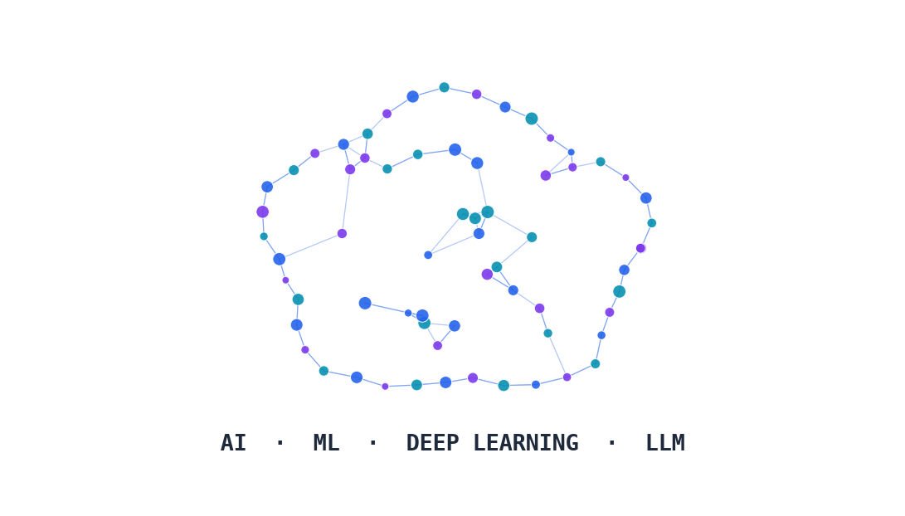

# Understanding LLMs

### What AI, machine learning, and large language models actually are — and how to see one in action

---

> Speaker notes: see [0:00–2:00 | Welcome & Framing](../lesson_outline.md#000200--welcome--framing) in `lesson_outline.md`.

---

[Next: Welcome →](01-welcome.md)
