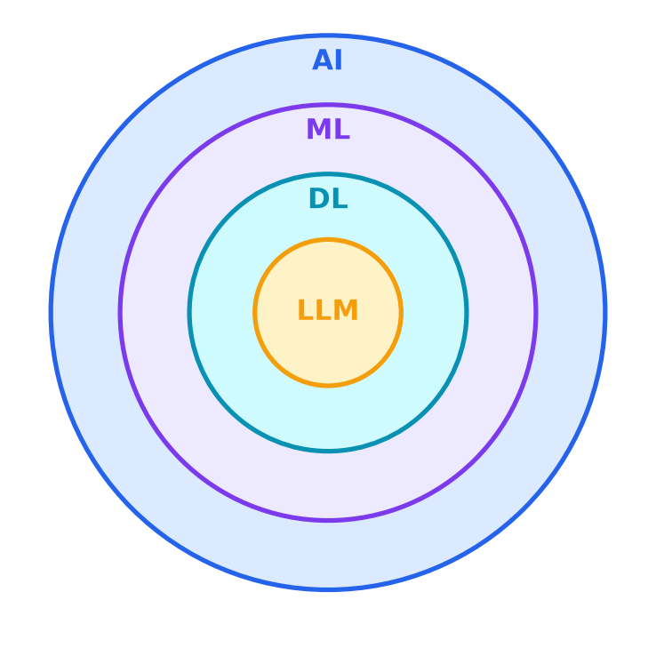

# The AI Landscape

- **AI** — any system that performs tasks normally requiring human intelligence (not all of it "learns")
- **Machine Learning** — systems that improve by learning patterns from data
- **Deep Learning** — machine learning using many-layered neural networks
- **LLM** — deep neural networks (transformers) trained on massive amounts of text

---

> Speaker notes: see [2:00–7:00 | Section 1: The AI Landscape](../lesson_outline.md#020700--section-1-the-ai-landscape) in `lesson_outline.md`.
