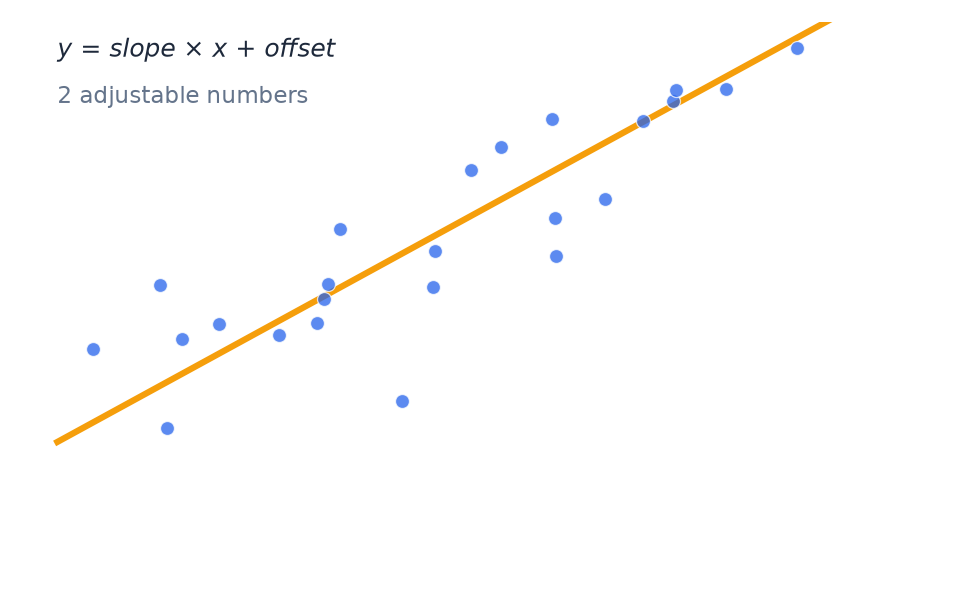

# (Optional) Deep Learning as Finding the Best-Fit Line

- A straight line has two adjustable numbers: slope and starting point.
- "Fitting" means nudging those numbers until the line sits as close as possible to all the points.
- That's the same basic idea behind training any machine learning model.

---

> Speaker notes: see the "Optional deeper analogy" callout in [Section 1](../lesson_outline.md#020700--section-1-the-ai-landscape) in `lesson_outline.md`. Use only if time allows.

---

[← Previous: The AI Landscape](02-ai-landscape.md) · [Next: (Optional) Adding complexity →](04-adding-complexity.md)
