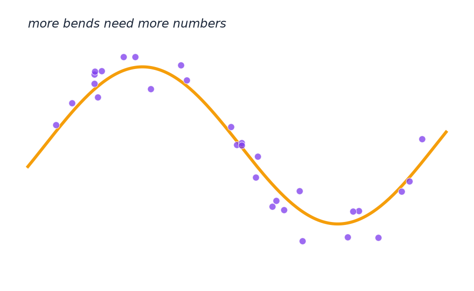

# (Optional) Adding Complexity

- A straight line fits this data poorly.
- A curved line needs more adjustable numbers to describe its bend.
- More complex patterns require more parameters.

---

> Speaker notes: see the "Optional deeper analogy" callout in [Section 1](../lesson_outline.md#020700--section-1-the-ai-landscape) in `lesson_outline.md`. Use only if time allows.

---

[← Previous: (Optional) Best-fit line](03-best-fit-line.md) · [Next: (Optional) Going further →](05-going-further.md)
