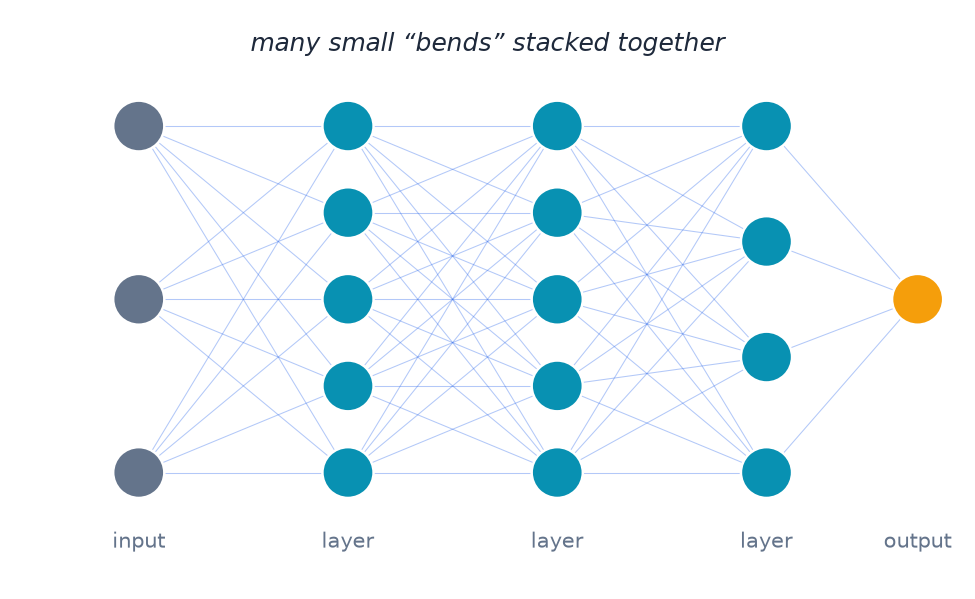

# (Optional) Going Further

- Real-world data (photos, sentences, sound) is too complex for one curve.
- A deep neural network chains together many simple "bends" (layers), each nudging the data a little.
- Combined, they approximate patterns no single equation could capture — that's the "deep" in deep learning.

---

> Speaker notes: see the "Optional deeper analogy" callout in [Section 1](../lesson_outline.md#020700--section-1-the-ai-landscape) in `lesson_outline.md`, including the honest caveat about real networks operating in many more dimensions.
