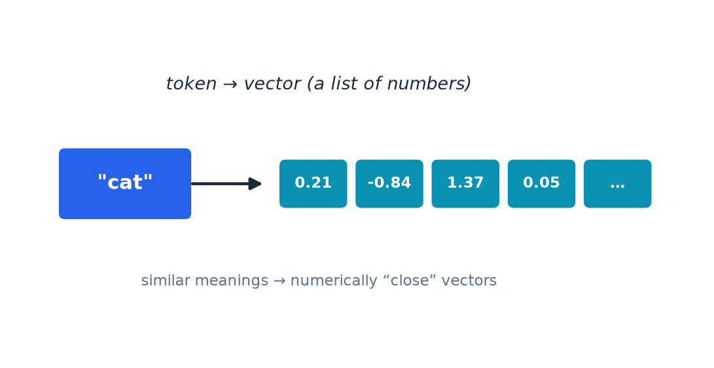

# Turning Tokens Into Numbers

- Each token becomes a **vector** — a list of numbers the neural network can process.
- The network's trained layers figure out how tokens relate to each other and what they mean in context.

---

> Speaker notes: see [7:00–15:00 | Section 2: What Is an LLM Actually Doing?](../lesson_outline.md#07001500--section-2-what-is-an-llm-actually-doing) in `lesson_outline.md`.
