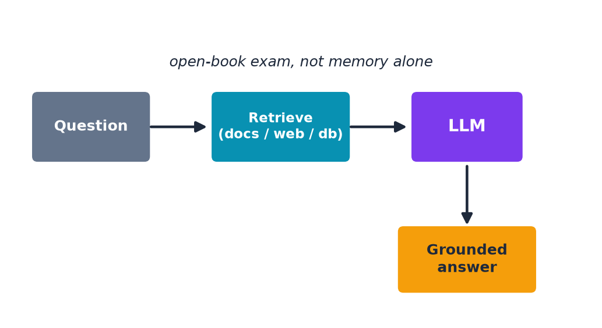

# RAG: Retrieval-Augmented Generation

- LLMs only know what they were trained on, up to a training cutoff date.
- **RAG** retrieves relevant information first, then hands it to the LLM as extra context.
- Like an open-book exam instead of answering purely from memory.

**Live demo moment (optional):** ask a question needing current information (e.g. today's weather).

---

> Speaker notes: see [15:00–19:00 | Section 3: RAG](../lesson_outline.md#15001900--section-3-rag-retrieval-augmented-generation) in `lesson_outline.md`.
