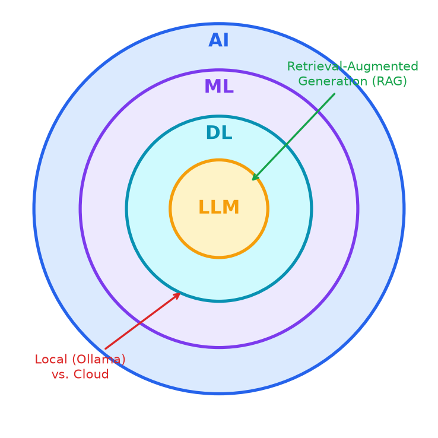

# Wrap-Up

- AI → ML → DL → LLM, plus RAG as an extension on top of an LLM.
- Local-vs-cloud tradeoff from the Ollama demo.
- The core idea — predicting the next word based on patterns — is simple. Everything built on top of it is what makes it feel powerful.

---

> Speaker notes: see [28:00–31:00 | Wrap-Up & Q&A](../lesson_outline.md#28003100--wrap-up--qa) in `lesson_outline.md`.
