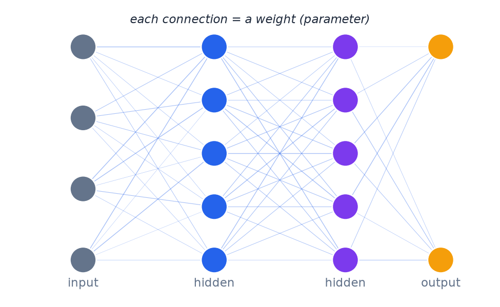

# Appendix: What Is a Neural Network?

- Layers: an input layer, one or more "hidden" layers, and an output layer.
- Each connection has a numerical **weight** controlling how much influence it has.
- "Deep" = many hidden layers stacked together.

> Analogy: an assembly line, where each station makes a small adjustment to the item passing through.

---

> Speaker notes: see [FAQ: What is a neural network?](../lesson_outline.md#faq-key-terms-explained) in `lesson_outline.md`.
