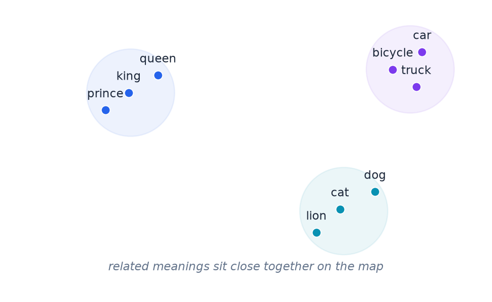

# Appendix: What Is a Vector?

- A list of numbers representing something (like a token) as a point in space.
- Tokens with similar meanings end up numerically "close" to each other.

> Analogy: GPS coordinates on a giant "meaning map."

---

> Speaker notes: see [FAQ: What is a vector?](../lesson_outline.md#faq-key-terms-explained) in `lesson_outline.md`.
