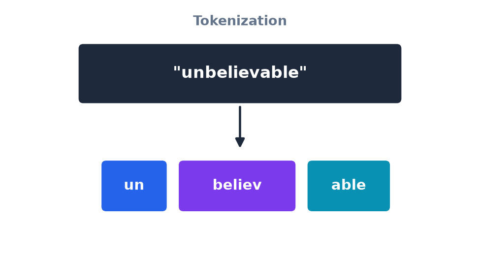

# What Is an LLM Actually Doing? — Tokenization

- The model breaks your text into small chunks called **tokens**.
- Tokens aren't always whole words.
- This step is mechanical — tokens don't carry meaning yet on their own.

[← Previous: The AI Landscape](02-ai-landscape.md) · [Next: Tokens to vectors →](04-tokens-to-vectors.md)
