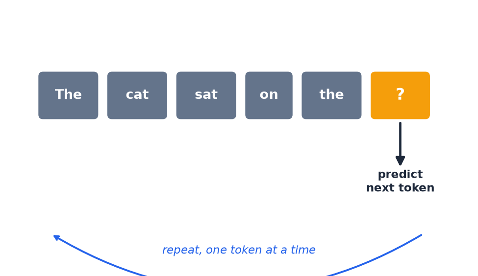

# Predicting the Next Token

- The model looks at everything so far and calculates the most probable **next token**.
- It adds that token to the sequence, then repeats — one token at a time — until the response is complete.

[← Previous: Tokens to vectors](04-tokens-to-vectors.md) · [Next: Regression →](06a-regression.md)
