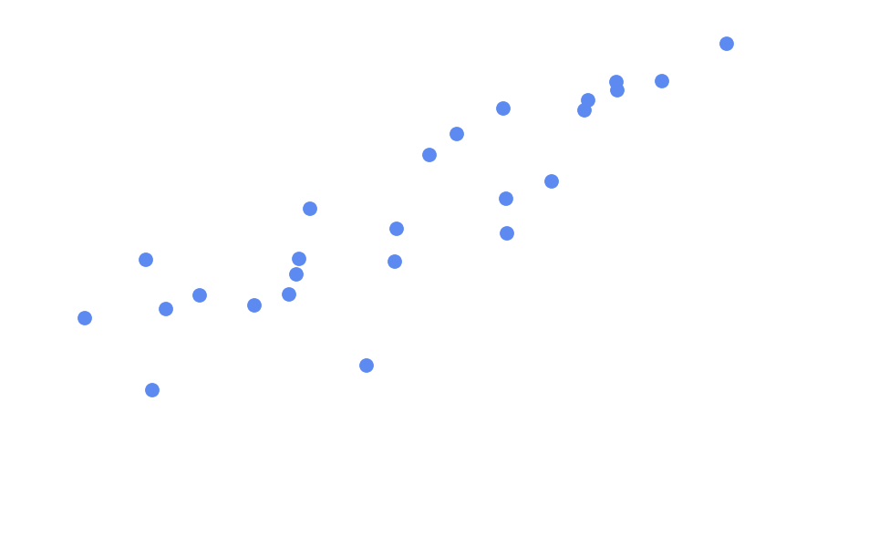

# Deep Learning as Finding the Best-Fit Line

- Data points on a graph show a pattern.
- We can estimate `y` given `x`.

[← Previous: Next-token prediction](05-next-token-prediction.md) · [Next: Regression (cont.) →](06b-regression.md)
