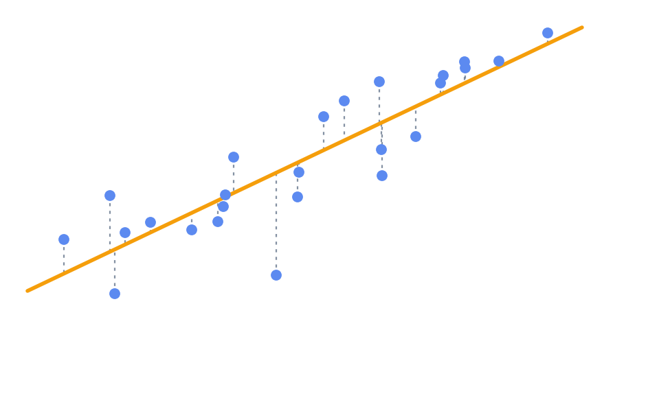

# Deep Learning as Finding the Best-Fit Line

- Line defined by least cumulative distance.
- Precise "best guess" for `y` given `x`.

[← Previous: Regression](06a-regression.md) · [Next: Adding Complexity →](07a-adding-complexity.md)