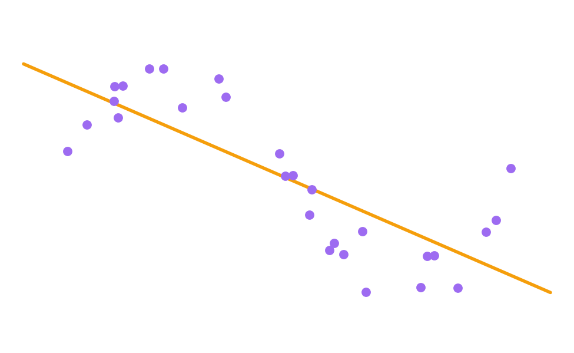

# Adding Complexity

- A straight line fits this data poorly.
- "Works" but some best guesses have large error.

[← Previous: Regression (cont.)](06b-regression.md) · [Next: Adding Complexity (cont.) →](07b-adding-complexity.md)
