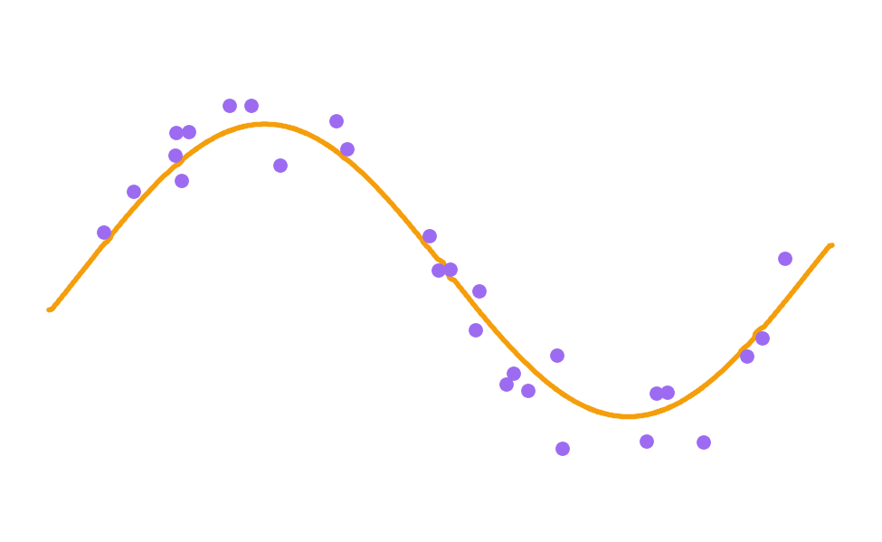

# Adding Complexity

- A curved line needs more adjustable numbers to describe its bend.
- More complex patterns require more parameters.

[← Previous: Adding Complexity](07a-adding-complexity.md) · [Next: Going further →](08-going-further.md)