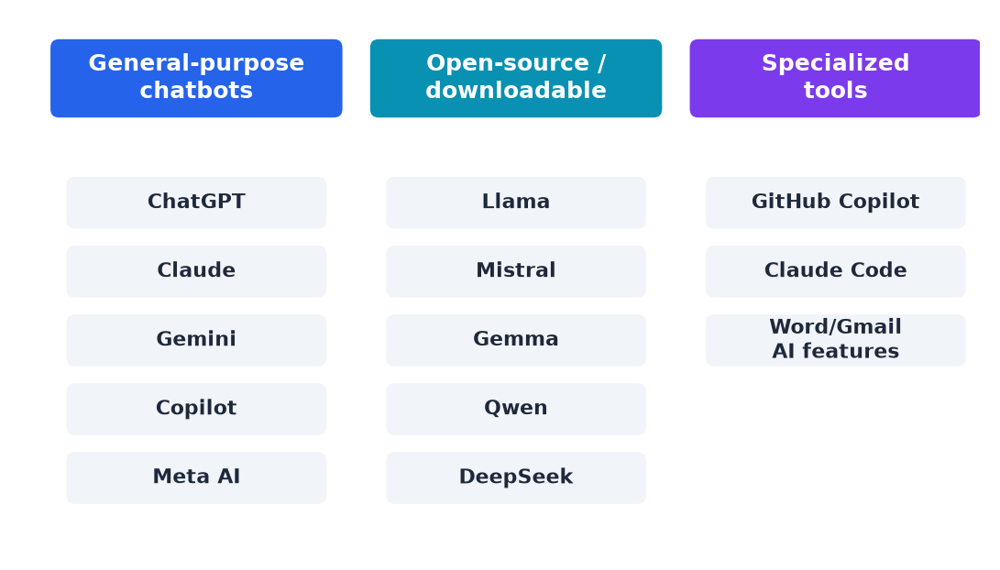

# The Current Landscape of Offerings

- **General-purpose chatbots/assistants:** ChatGPT, Claude, Gemini, Copilot, Meta AI
- **Open-source / downloadable models:** Llama, Mistral, Gemma, Qwen, DeepSeek
- **Specialized tools built on these models:** coding assistants, productivity integrations
- Common thread: most are the same underlying idea (an LLM, sometimes with RAG or agent capabilities) packaged for a use case

---

> Speaker notes: see [19:00–23:00 | Section 4: The Current Landscape of Offerings](../lesson_outline.md#19002300--section-4-the-current-landscape-of-offerings) in `lesson_outline.md` for the full reference table (good as a handout/backup slide, dense for a live slide).

---

[← Previous: RAG](09-rag.md) · [Next: Live demo: Ollama →](11-live-demo-title.md)
