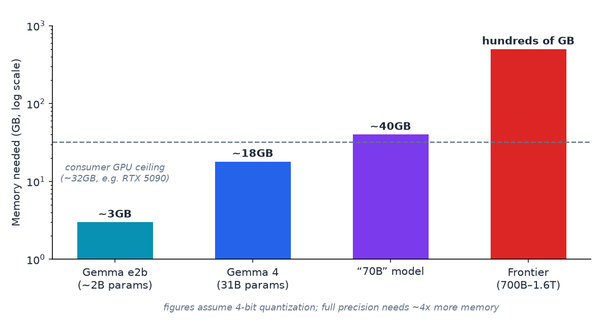

# Why Bigger Models Need Bigger Hardware

- **Parameters** are roughly the number of knobs a model tuned during training.
- Gemma e2b: ~3GB · Gemma 4 (31B): ~17–18GB · 70B model: ~40GB · Largest 2026 open models (700B–1.6T): hundreds of GB across enterprise GPUs
- Figures assume 4-bit quantization; a full-precision 70B model would need closer to 140GB. Consumer GPU ceiling is now ~32GB (e.g. RTX 5090), up from the 24GB ceiling of the prior generation.
- **The "aha":** frontier models aren't secret code — they're often just too large to fit on a personal computer, so companies run them in data centers.

---

> Speaker notes: see [23:00–28:00 | Section 5: Live Demo](../lesson_outline.md#23002800--section-5-live-demo--running-an-open-model-yourself-ollama) in `lesson_outline.md`. Do not attempt to load a 70B+ model live.

---

[← Previous: Live demo: Ollama](11-live-demo-title.md) · [Next: Wrap-up →](13-wrapup.md)
