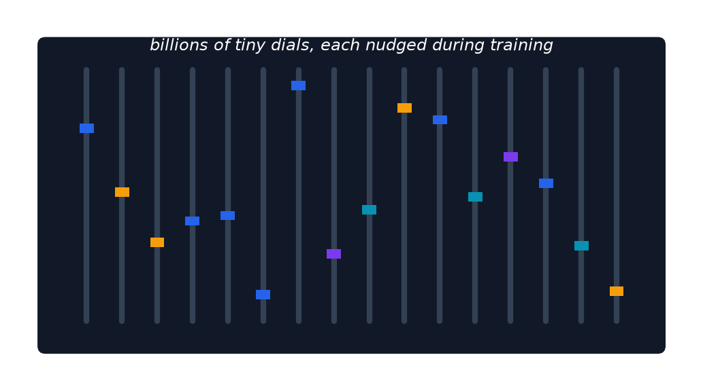

# Appendix: What Is a Model Parameter?

- An individual numerical value (weight) inside a neural network, adjusted during training.
- "70 billion parameters" = 70 billion tunable dials.
- More parameters → more capacity for complex patterns, but more memory required.

> Analogy: a massive soundboard with billions of tiny sliders nudged to precise positions.

[← Previous: Appendix: Vector](16-appendix-vector.md) · [Next: Appendix: Agent →](18-appendix-agent.md)
