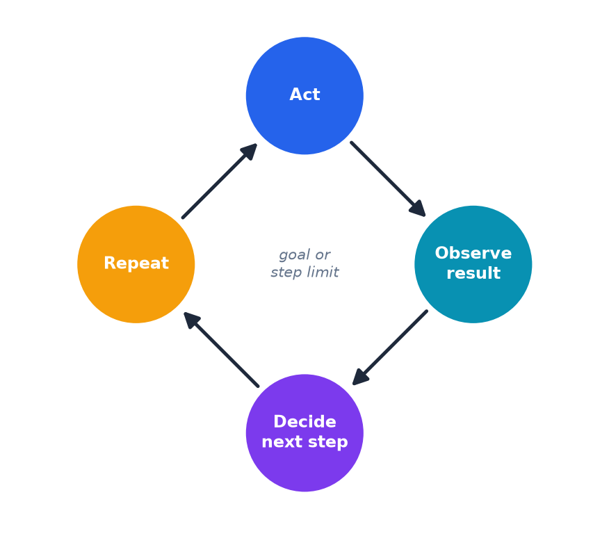

# Appendix: What Is an Agent?

- A regular chatbot only talks. An **agent** gets tools: search the web, run code, browse, call other software.
- Works in a loop — act, observe, decide, repeat — until it reaches its goal or a stopping point.
- Agents can only do what their tools allow; most real-world uses include guardrails or human checkpoints.

> Analogy: a chatbot is a knowledgeable person on the phone; an agent is that same person handed the keys to go do the task.

[← Previous: Appendix: Hardware contrast](16-appendix-hardware-contrast.md) · [Next: Appendix: Chinese Room →](18-appendix-chinese-room.md)
